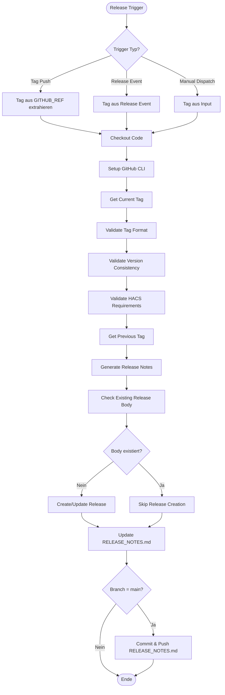

# Release-Workflow Dokumentation

## Übersicht

Dieses Dokument beschreibt den automatisierten Release-Workflow für die Ostrom Advanced Home Assistant Integration. Der Workflow ist vollständig automatisiert und erfordert nur das Erstellen eines Git-Tags.

## Release-Prozess

### Workflow-Fluss



### Trigger

Der Release-Workflow wird durch drei verschiedene Events getriggert:

1. **Tag Push**: Wenn ein Tag mit dem Format `v*` (z.B. `v0.4.0`) gepusht wird
2. **Release Event**: Wenn ein Release auf GitHub manuell erstellt wird
3. **Manual Dispatch**: Manuelles Triggern über die GitHub Actions UI mit Tag-Name als Input

### Validierungen

Der Workflow führt folgende Validierungen durch:

1. **Tag-Format-Validierung**: Prüft, ob der Tag dem Semantic Versioning Format entspricht (`vX.Y.Z` oder `vX.Y.Z-prerelease`)
2. **Version-Konsistenz-Prüfung**: Vergleicht die Tag-Version mit der Version in `manifest.json` und schlägt fehl bei Mismatch
3. **HACS-Anforderungen**: Prüft, ob alle notwendigen Dateien für HACS vorhanden sind (`hacs.json`, `manifest.json`, `README.md`)

### Release Notes Generierung

Die Release Notes werden automatisch aus den Commits zwischen dem vorherigen und aktuellen Tag generiert:

- **Kategorisierung**: Commits werden nach Conventional Commits kategorisiert:
  - `feat:` / `feature:` → New Features
  - `fix:` / `bug:` → Bug Fixes
  - `chore:` / `refactor:` → Maintenance
  - `docs:` → Documentation
  - Andere → Other Changes

- **Priorität**: Features → Fixes → Maintenance → Docs → Other

- **Merge-Commits**: Werden automatisch ausgeschlossen

### Release-Erstellung

- Wenn ein Release bereits existiert und Release Notes hat, werden diese beibehalten
- Wenn kein Release existiert oder keine Notes vorhanden sind, wird ein neues Release mit generierten Notes erstellt
- Das Release wird automatisch als "published" markiert (nicht als Draft oder Pre-Release)

### RELEASE_NOTES.md Update

- Die Datei `RELEASE_NOTES.md` wird automatisch mit dem neuen Release-Eintrag aktualisiert
- Der neue Eintrag wird am Anfang der Datei eingefügt
- Die Datei wird nur auf dem `main` Branch committed und gepusht
- Retry-Logik verhindert Race Conditions bei parallelen Releases

## Branch-Strategie

### Release-Branches

- **Haupt-Branch**: `main`
- **Release-Tags**: Werden direkt auf `main` erstellt
- **RELEASE_NOTES.md Commit**: Wird nur auf `main` durchgeführt

### Workflow-Verhalten

- Der Workflow kann von jedem Branch getriggert werden (Tag-Push, Release Event, Manual Dispatch)
- Die `RELEASE_NOTES.md` wird nur committed, wenn der Workflow auf `main` läuft
- Bei anderen Branches wird die Datei aktualisiert, aber nicht committed

## Release erstellen

### Schritt-für-Schritt Anleitung

1. **Version in manifest.json aktualisieren**
   ```bash
   # Ändere die Version in custom_components/ostrom_advanced/manifest.json
   # z.B. von "0.4.3" auf "0.4.4"
   ```

2. **Änderungen committen und pushen**
   ```bash
   git add custom_components/ostrom_advanced/manifest.json
   git commit -m "chore: release v0.4.4"
   git push origin main
   ```

3. **Git Tag erstellen und pushen**
   ```bash
   # Tag auf main HEAD erstellen (WICHTIG: direkt auf main, nicht auf Feature-Branch)
   git tag v0.4.4 origin/main
   git push origin v0.4.4
   ```

4. **Workflow läuft automatisch**
   - Der Workflow wird durch den Tag-Push getriggert
   - Release Notes werden automatisch generiert
   - GitHub Release wird erstellt
   - `RELEASE_NOTES.md` wird aktualisiert und committed

### Wichtige Hinweise

- **Tag muss auf main zeigen**: Der Tag muss direkt auf `main` HEAD zeigen, damit er im GitHub Release-Formular erscheint
- **Version-Konsistenz**: Die Tag-Version muss exakt mit der Version in `manifest.json` übereinstimmen (ohne `v`-Präfix)
- **Tag-Format**: Tags müssen dem Format `vX.Y.Z` entsprechen (z.B. `v0.4.4`, nicht `0.4.4`)

## Troubleshooting

### Workflow schlägt bei Version-Konsistenz-Prüfung fehl

**Problem**: Tag-Version stimmt nicht mit `manifest.json` überein

**Lösung**: 
1. Prüfe die Version in `manifest.json`
2. Stelle sicher, dass der Tag das richtige Format hat (`vX.Y.Z`)
3. Aktualisiere entweder `manifest.json` oder erstelle den Tag neu

### RELEASE_NOTES.md wird nicht committed

**Problem**: Workflow läuft, aber `RELEASE_NOTES.md` wird nicht committed

**Mögliche Ursachen**:
1. Workflow läuft nicht auf `main` Branch
2. Keine Änderungen an der Datei (bereits aktuell)
3. Git-Push schlägt fehl (siehe Logs)

**Lösung**: 
- Prüfe die Workflow-Logs
- Stelle sicher, dass der Tag auf `main` erstellt wurde
- Prüfe Git-Permissions

### Release Notes sind leer

**Problem**: Release Notes enthalten keine Commits

**Mögliche Ursachen**:
1. Keine Commits zwischen vorherigem und aktuellem Tag
2. Alle Commits sind Merge-Commits (werden ausgeschlossen)
3. Commits folgen nicht dem Conventional Commits Format

**Lösung**: 
- Prüfe die Git-Historie zwischen den Tags
- Stelle sicher, dass Commits dem Conventional Commits Format folgen

### Race Conditions beim RELEASE_NOTES.md Commit

**Problem**: Merge-Konflikte beim automatischen Commit

**Lösung**: 
- Der Workflow hat bereits Retry-Logik implementiert
- Bei Konflikten wird automatisch ein Rebase durchgeführt
- Bei wiederholten Fehlern: Manuell committen

## Workflow-Konfiguration

### Concurrency

Der Workflow verwendet eine Concurrency-Gruppe, um parallele Ausführungen zu verhindern:
- **Group**: `release-${{ github.ref }}`
- **Cancel in progress**: `false` (wartet auf laufende Workflows)

### Timeouts

Alle kritischen Steps haben Timeouts konfiguriert:
- GitHub CLI Setup: 5 Minuten
- Get Previous Tag: 2 Minuten
- Generate Release Notes: 5 Minuten
- Get Existing Release Body: 2 Minuten
- Validate HACS Requirements: 2 Minuten
- Create/Update Release: 3 Minuten
- Update RELEASE_NOTES.md: 3 Minuten
- Commit and Push: 3 Minuten

### Permissions

- `contents: write` - Für Release-Erstellung und Git-Operationen
- `issues: read` - Für Release-Drafter (falls verwendet)

## HACS-Integration

HACS erkennt neue Versionen automatisch über:
- **Git-Tags**: HACS prüft Git-Tags für neue Versionen
- **manifest.json**: Die Version in `manifest.json` wird von HACS gelesen
- **Automatische Updates**: Nach einem Release werden Updates in HACS verfügbar

### HACS-Anforderungen

Die folgenden Dateien müssen vorhanden sein:
- `hacs.json` - HACS-Konfiguration (erforderlich)
- `custom_components/ostrom_advanced/manifest.json` - Mit gültigem `version` Feld (erforderlich)
- `README.md` - Dokumentation (empfohlen)

Der Workflow validiert diese Anforderungen automatisch vor jedem Release.

## Best Practices

1. **Conventional Commits verwenden**: Alle Commits sollten dem Conventional Commits Format folgen
2. **Version-Konsistenz**: Immer sicherstellen, dass Tag und `manifest.json` übereinstimmen
3. **Tag auf main**: Tags immer direkt auf `main` erstellen, nicht auf Feature-Branches
4. **Release Notes prüfen**: Vor dem Tag-Push die generierten Release Notes in den Logs prüfen
5. **Test-Releases**: Für Tests können Pre-Release-Tags verwendet werden (`v0.4.4-beta`)

## Workflow-Optimierungen

Der Workflow wurde optimiert für:
- **Performance**: Redundante Commit-Analysen wurden eliminiert
- **Robustheit**: Fehlerbehandlung und Retry-Logik implementiert
- **Sicherheit**: Version-Validierung, Tag-Format-Prüfung und HACS-Validierung
- **Effizienz**: GitHub CLI Setup via Action, Timeouts für alle kritischen Steps

## Release-Drafter

Der Release-Drafter Workflow (`.github/workflows/release-drafter.yml`) wird bei Pull Requests getriggert und erstellt automatisch Release-Drafts basierend auf der Konfiguration in `.github/release-drafter.yml`.

**Hinweis**: Der Release-Drafter ist optional und wird nur verwendet, wenn manuell Releases über die GitHub UI erstellt werden. Der Haupt-Release-Workflow funktioniert unabhängig davon.
